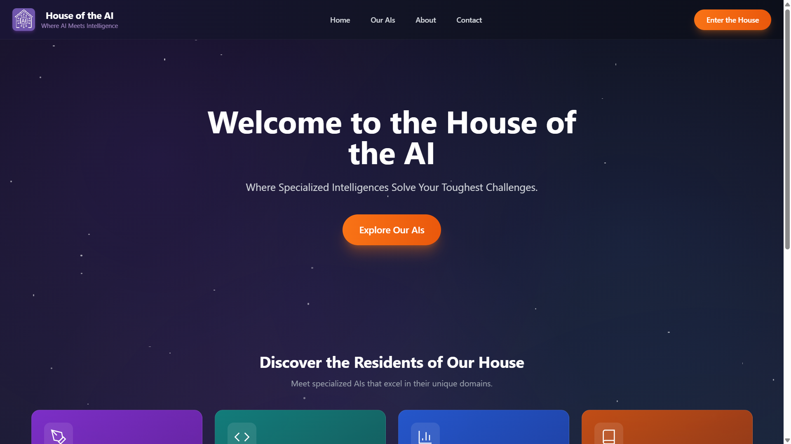
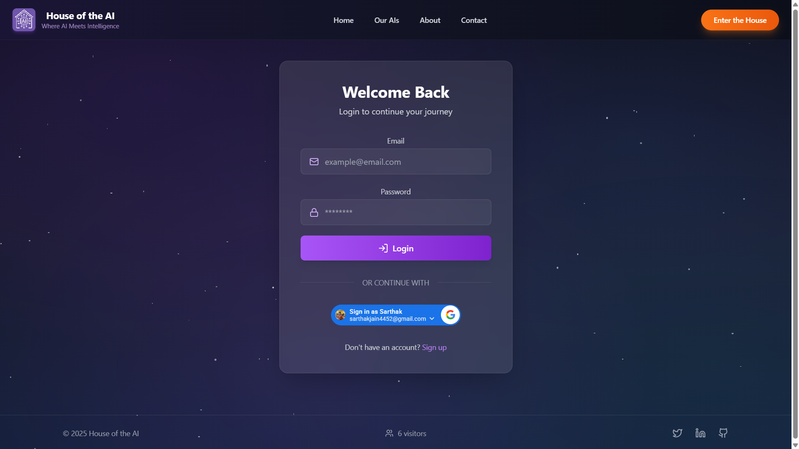
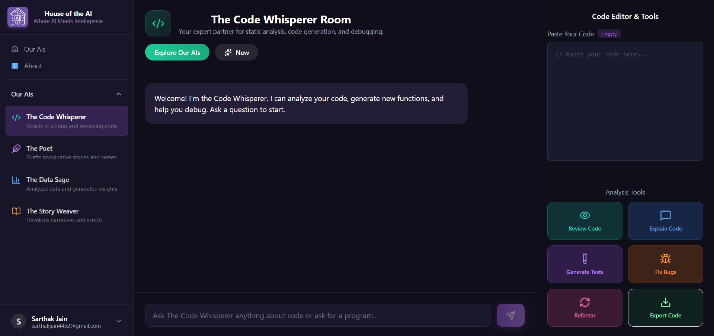
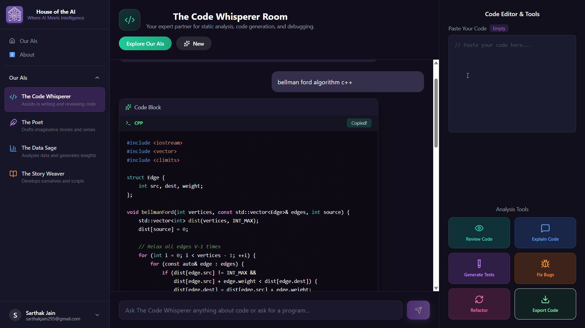
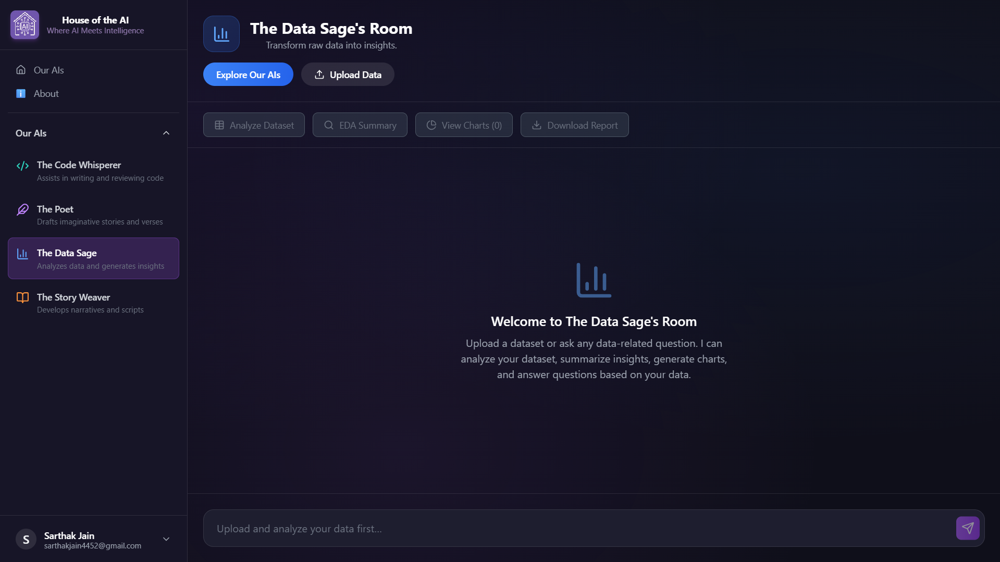
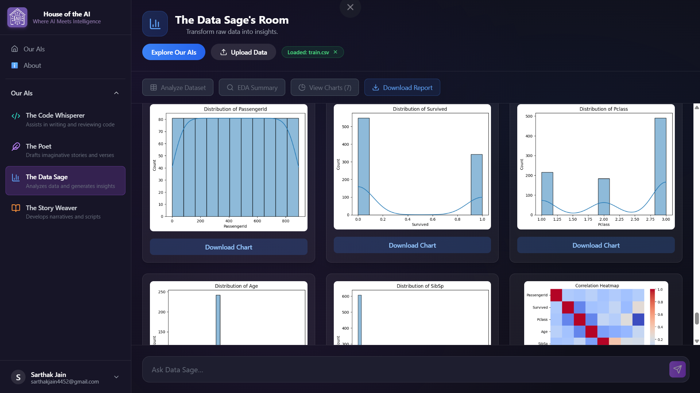
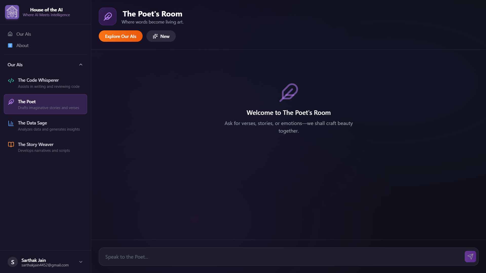
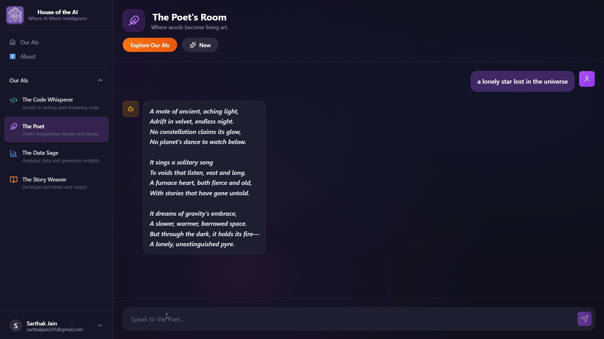
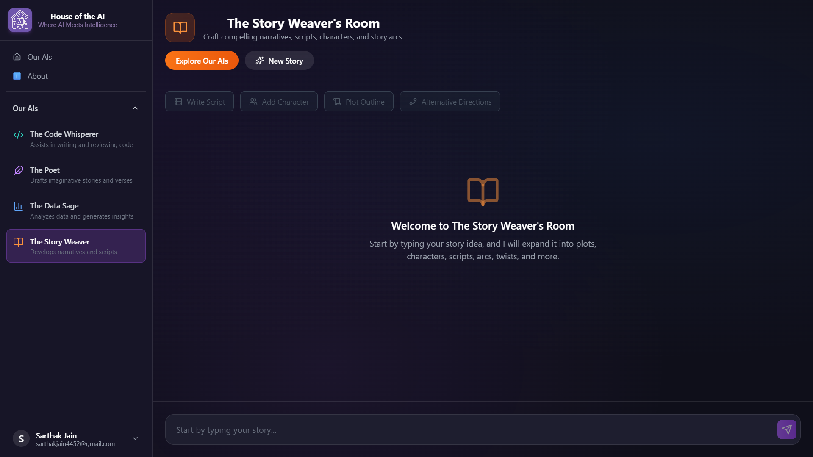
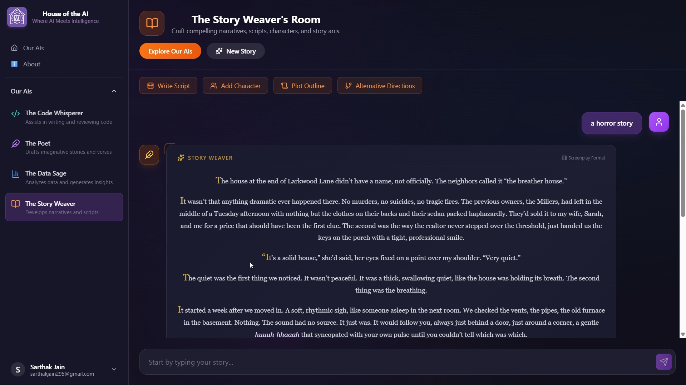

# House of the AI  
### A Multi-Agent Conversational AI Universe  
**Coding • Data Analysis • Poetry • Storytelling**


## Project Live Link: https://house-of-the-ai.vercel.app

---

## Overview

**House of the AI** is a fully interactive, multi-agent conversational platform where each "Room" contains a powerful specialized AI with unique skills, personality, and tools.  
It provides a premium user experience with authentication, saved conversations, dataset analysis, code tools, and creative storytelling features — all inside one unified ecosystem.

Users can explore:

-  **The Code Whisperer** → code analysis, debugging, refactoring  
-  **The DataSage** → dataset upload, EDA, visual charts, reports  
-  **The Poet** → creative poetry & lyrical writing  
-  **The Story Weaver** → story generation, plot twists, scripts  

With stunning animations, protected routes, Google login, OTP verification, dynamic tools, and more — House of the AI feels like a next-generation digital workspace.



---

## 🔐 Authentication & User Features

The platform includes a complete authentication system:

### ✨ **User Authentication**
- Google Login / Signup  
- Email + Password Signup  
- OTP verification  
- Fully protected routes  
- Automatic session handling

- 

###  **User Experience Features**
- Saved chat history inside **Talks Section**  
- Users can revisit any previous conversation  
- Feedback system to collect user reviews  
- Responsive UI across all devices  

---

#  AI Rooms & Their Capabilities

---

## 🧑‍💻 1. Code Whisperer Room

Your personal expert programmer with specialized tools.

### 🛠️ **Tools Inside the Room**
- **Review Code** → Static code analysis  
- **Explain Code** → Line-by-line explanations  
- **Generate Tests** → Auto-generate test cases  
- **Fix Bugs** → Debug existing code  
- **Refactor Code** → Optimize for readability/performance  
- **Export Code** → Download or copy polished code  

### ⭐ **Features**
- Premium syntax highlighting  
- AI-powered code block formatting  
- Copy-to-clipboard  
- Confidence scoring  
- Clean dark-themed terminal-style UI
- 

---

## 📊 2. DataSage Room

A full-fledged **data analysis AI workspace** where users can upload datasets and generate insights.

### 📁 **Upload & Process Datasets**
- Upload CSV, TSV, JSON files  
- Automatic validation  
- Secure file handling
- 

### 📊 **Tools Inside DataSage**
- **Analyze Dataset** → First-look analysis  
- **EDA Summary** → Insights, distributions, correlations  
- **Generate Visual Charts** →  
  - Histograms  
  - Bar charts  
  - Heatmaps  
  - Line charts  
- **Download Report** → Generates a complete PDF/Markdown report
-  
- 

### ⭐ **Capabilities**
- Explains trends and statistics in simple terms  
- Breaks down ML concepts when asked  
- Helps users interpret their dataset  
- Suggests next steps based on the data  

This room transforms data analytics into a conversational experience.

---

## ✒️ 3. Poet Room

A creative AI with artistic personality.

### ⭐ **Creates**
- Poems  
- Verses  
- Romantic prose  
- Aesthetic lines  
- Mood-based writing (happy, sad, nostalgic, etc.)
- 
- 

Beautiful animated entry screen and elegant chat UI elevate the writing experience.

---

## 🎬 4. Story Weaver’s Room

A storytelling engine that helps you build entire worlds.

### 🎥 **Features Inside the Room**
- **Generate Script** from a user-given story idea  
- **Add New Character** to introduce a twist  
- **Plot Outline** generation  
- **Alternative Directions** → Explore multiple future story paths  
- Character-driven branching stories  
- Immersive creative explanations
- 
- 

This AI acts like your co-writer for novels, films, or short stories.

---

# 🖥️ Tech Stack

| Layer | Tools Used |
|-------|------------|
| Frontend | React.js, TailwindCSS, Vite |
| UI/Animation | shadcn/ui, Framer Motion, Lucide Icons |
| AI Backend | API Inferencing |
| Data Processing | Python backend + Pandas + Matplotlib + Seaborn |
| Auth | Google OAuth, JWT protected routes, OTP verification |
| Storage | MongoDB database |
| Deployment | Render and Vercel |

---


#  Installation & Setup

### 1️⃣ Clone the Repo
```bash
git clone https://github.com/sarthak-jain03/House-of-the-AI.git
cd House-of-the-AI
```

### 2️⃣ Install Dependencies
```bash
npm install
```

### 3️⃣ Create `.env` File
```
VITE_INFERENCE_API=your_api_key
VITE_GOOGLE_CLIENT_ID=your_google_client_id
VITE_BACKEND_URL=your_backend_endpoint
```

### 4️⃣ Run the Project
```bash
npm run dev
```

---


# 🎥 Project Video
```
https://youtu.be/Rvx6W0qOzLs
```

---

# ✨ Features Summary

### ✔️ Multi-Agent AI Rooms  
### ✔️ Dataset Upload, EDA, Charts  
### ✔️ Google Login & OTP Authentication  
### ✔️ Protected Routes  
### ✔️ Saved Conversations (Talks Section)  
### ✔️ Feedback System  
### ✔️ Code Tools (Review, Fix, Tests, Refactor, Export)  
### ✔️ Story Tools (Plot, Script, Twist, Alternatives)  
### ✔️ Modern UI with Framer Motion  
### ✔️ Backend-integrated report generation  

This is not just an AI app — it’s a **complete AI ecosystem**.

---

# 🛠️ Future Enhancements

- Multi-language support  
- AI Personas marketplace  
- Team-based collaboration rooms  
- Export stories/scripts as PDF  
- Voice-based AI interaction  
- Data visualization dashboards  

---


# Author

**Sarthak Jain**  
Creator of *House of the AI* — a next-generation AI universe designed for creators, developers, analysts, and storytellers.
****
**Email:** sarthakjain4452@gmail.com 

---
